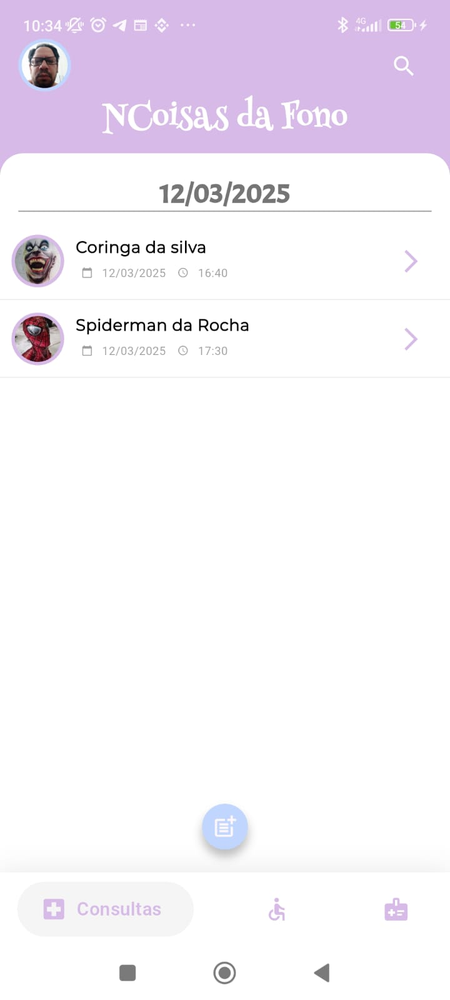
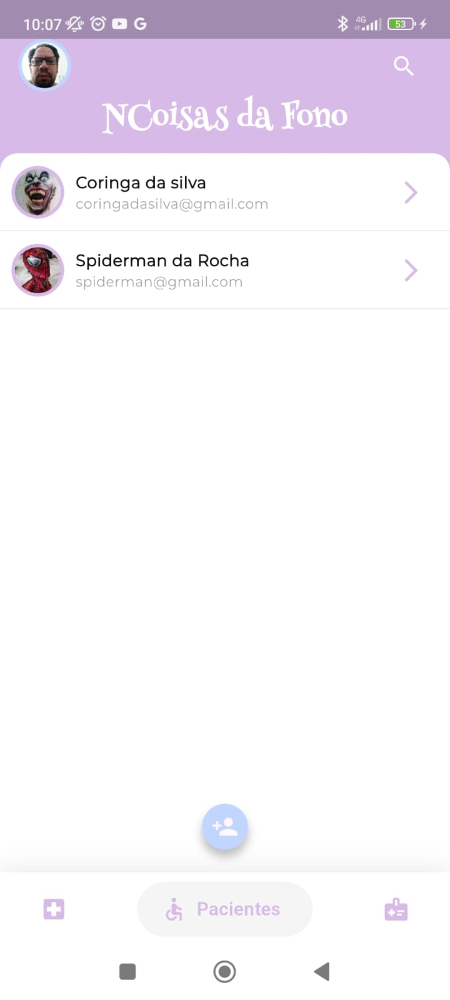
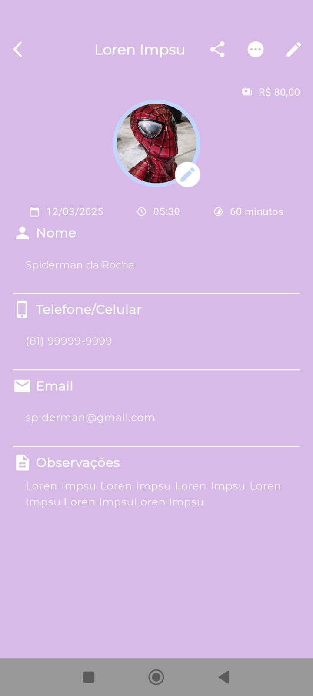
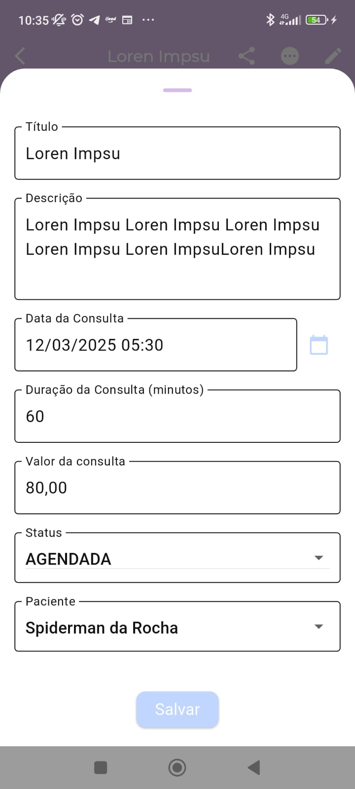
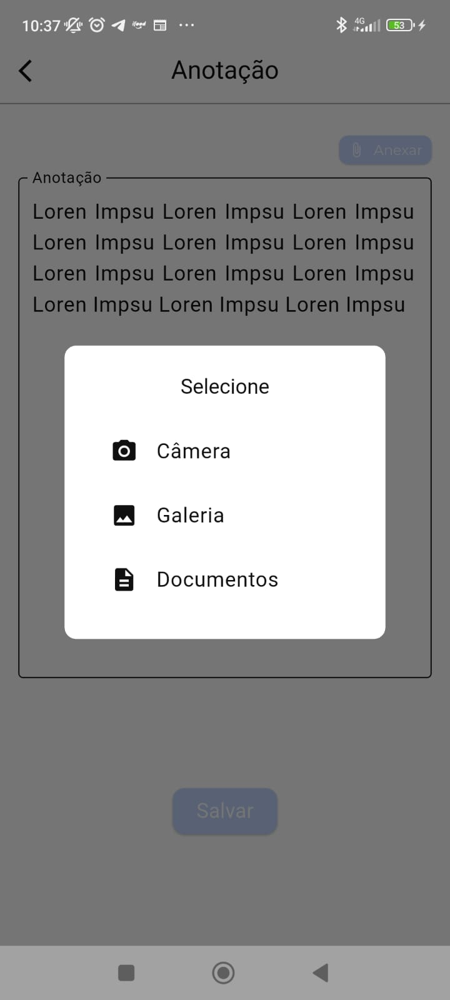
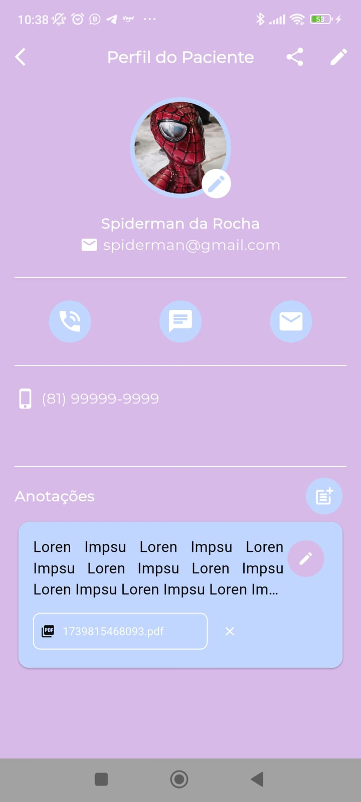

# NCoisas da Fono 
[Leia em Português](README_PT.md)

Welcome to **NCoisas da Fono**, a Flutter application developed for speech therapists to manage appointments, patients, and information in a practical and efficient way. This app uses ObjectBox as a local database and offers an intuitive interface to organize professional routines.

## Description

NCoisas da Fono is a tool designed for speech therapists, allowing the registration of doctors (the main user), patients, and appointments. With smooth navigation between screens, the app supports:
- Appointment registration with date and time.
- Patient management with personalized details.
- A daily-use interface with support for search and date navigation.

The application is open-source and was developed with Flutter, ensuring compatibility with Android and potential for other platforms in the future.

## Screenshots

<table>
  <tr>
    <td align="center">
      
      <br>Appointments Screen
    </td>
    <td align="center">
      
      <br>Patient Listing
    </td>
    <td align="center">
      
      <br>Patient Profile
    </td>
  </tr>
  <tr>
    <td align="center">
      
      <br>Patient Editing
    </td>
    <td align="center">
      
      <br>Patient Notes
    </td>
    <td align="center">
      
      <br>Patient Profile
    </td>
  </tr>
</table>

## Installation

### Via Release

1. **Download the NCoisas da Fono Release**:
   - Visit [Releases](https://github.com/Gambya/N-Coisas-da-Fono/releases/) and install the application by accepting the Android device security prompts.

### Via Repository and Flutter

To run the application locally from the source code using Flutter, follow the steps below:

1. **Prerequisites**:
   - Install the [Flutter SDK](https://flutter.dev/docs/get-started/install) on your system.
   - Set up an Android emulator or connect a physical device.
   - Ensure Dart and the Android SDK are configured.

2. **Clone the Repository**:
   - Open a terminal and run the following command to clone the repository:
    ```bash
     git clone https://github.com/Gambya/NCoisas da Fono.git
    ```
   - Navigate to the project directory:
    ```bash
    cd NCoisas da Fono
    ```
3. **Install Dependencies**:
    - Run the command to download the dependencies listed in the `pubspec.yaml`:
    ```bash
    flutter pub get
    ```
4. **Generate ObjectBox Files**:
    - Ensure the ObjectBox files are generated. Run:
    ```bash
    flutter pub run build_runner build --delete-conflicting-outputs
    ```
5. **Run the Application**:
    - Start the app on an emulator or connected device:
    ```bash
    flutter run
    ```
    - The app will compile and open automatically. Follow the on-screen instructions to set up the doctor for the first time.
6. **(Optional) Build for APK**:
    - To generate an installable APK file, use:
    ```bash
    flutter build apk
    ```
    - The file will be located at `build/app/outputs/flutter-apk/app-release.apk`.

### Contributions
Contributions are welcome! Feel free to open issues or pull requests to suggest improvements, fix bugs, or add new features.

### License
This project is licensed under the [MIT License](LICENSE). . See the `LICENSE` file for more details.

